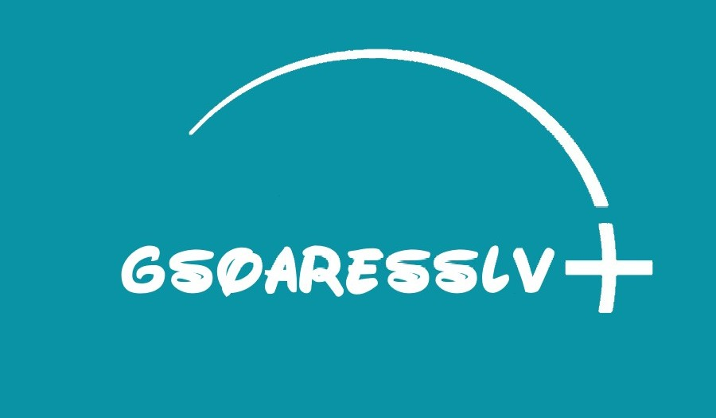

<h1 align="center">Hey, I'm Guilherme Silva</h1>
<h3 align="center">and you are watching my GitHub® page</h3>

   

---

### 👨‍💻 About Me

I'm a full-stack developer focused on **Web Development** and **Data Systems**, passionate about solving real-world problems through code.

- 🎓 Graduated in IT for the Internet – IFES  
- 🎓 Currently studying Information Systems – UNICAMP  
- 🚀 Tech enthusiast always exploring new tools and frameworks  
- 🌍 Looking for international opportunities and global collaboration  

---

### 🛠️ Tech Stack & Tools

- **Languages**: Java, Python, JavaScript, SQL  
- **Web**: HTML, CSS, Node.js, React  
- **Data**: MySQL, PostgreSQL, MongoDB, Pandas  
- **Cloud & DevOps**: AWS (basic), Git, GitHub Actions  
- **Tools**: VS Code, Postman, Figma, Linux  

---

### 📊 GitHub Stats

   
   

---

### 🚀 Focus Areas

- Full-Stack Development  
- Data Engineering & APIs  
- Cloud Infrastructure (learning path: AWS & DevOps)  
- Team management & leadership (student committees, group coordination)

---

<!-- Optional contact links later -->
